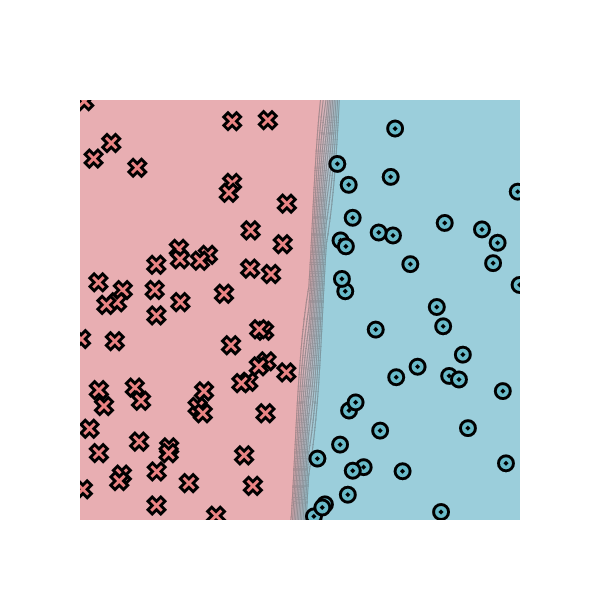

# MiniTorch Module 2

* Docs: https://minitorch.github.io/

* Overview: https://minitorch.github.io/module2.html

This assignment requires the following files from the previous assignments.

        minitorch/operators.py minitorch/module.py minitorch/autodiff.py minitorch/scalar.py minitorch/module.py project/run_manual.py project/run_scalar.py

Models:
1) Simple:

2) Diag:

3) Split:

4) Xor:

